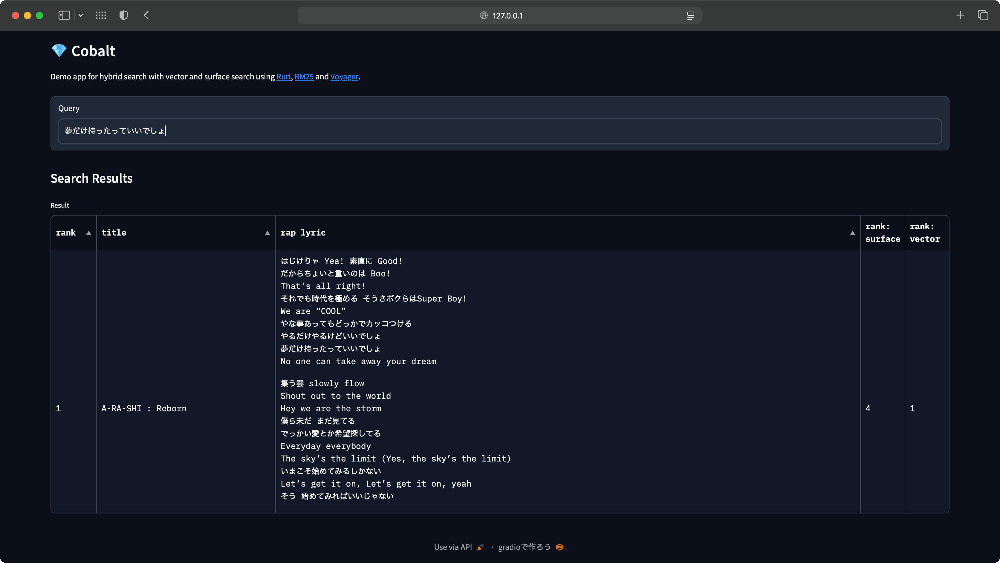

# Cobalt: Hybrid Search

Cobalt is a demo app for hybrid search with vector and surface search using [Ruri](https://huggingface.co/cl-nagoya/ruri-large), [BM25](https://github.com/dorianbrown/rank_bm25) and [Voyager](https://spotify.github.io/voyager/). The name cobalt is derived from the word 瑠璃 (Ruri), which refers to cobalt glass.

## Demo
This demo app is made by Gradio, deployed to [Hugging Face Space](https://huggingface.co/spaces/Shakshi3104/Cobalt).

On local, you can run this app below:

```bash
docker compose up --build
```
and, access to http://localhost:7860/



## Usage

```python
import pandas as pd
from model.search.hybrid import HybridSearchClient

# load documents from CSV file.
df = pd.read_csv("corpus.csv")

# Initialize search client
# Specify column name to be searched. e.g. "content"
search_client = HybridSearchClient.from_dataframe(df, "content")

# Search documents from a query
results = search_client.search_top_n("Arashi's history")

```

## Requirements

- Python 3.10
- rank_bm25
- huggingface
- voyager
- Other Python packages are refer to [requirements.txt](./requirements.txt)